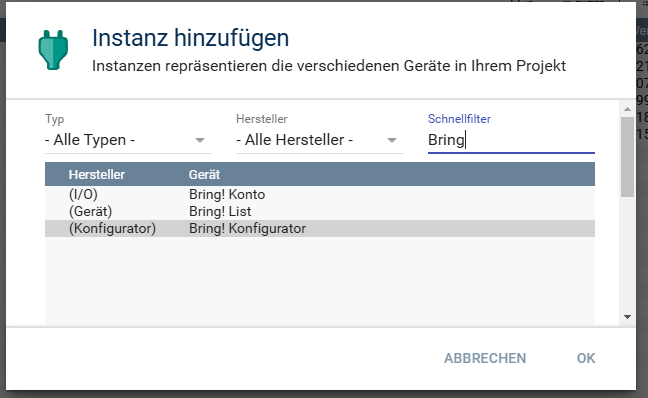
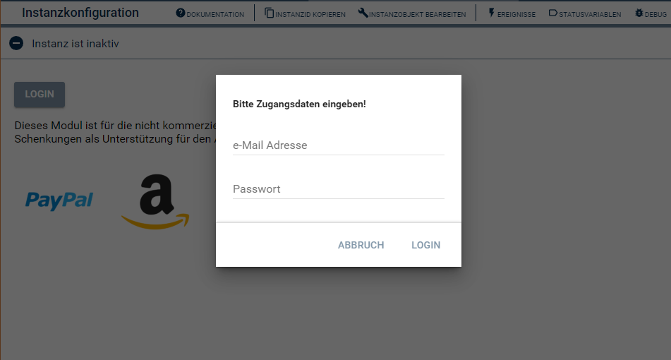

[](https://www.symcon.de/service/dokumentation/entwicklerbereich/sdk-tools/sdk-php/)
[]()
[](https://www.symcon.de/de/service/dokumentation/installation/migrationen/v80-v81-q3-2025/)  
[](https://creativecommons.org/licenses/by-nc-sa/4.0/)
[](https://github.com/Nall-chan/bring-symcon/actions)
[](https://github.com/Nall-chan/bring-symcon/actions)  
[](#2-spenden)[](#2-spenden)  

# Bring Konto  <!-- omit in toc -->
IO-Modul für einen Bring! Konto.  

## Inhaltsverzeichnis  <!-- omit in toc -->

- [1. Funktionsumfang](#1-funktionsumfang)
- [2. Voraussetzungen](#2-voraussetzungen)
- [3. Software-Installation](#3-software-installation)
- [4. Einrichten der Instanzen in IP-Symcon](#4-einrichten-der-instanzen-in-ip-symcon)
- [5. Statusvariablen](#5-statusvariablen)
- [6. Visualisierung](#6-visualisierung)
- [7. PHP-Befehlsreferenz](#7-php-befehlsreferenz)
- [8. Aktionen](#8-aktionen)
- [9. Anhang](#9-anhang)
  - [1. Changelog](#1-changelog)
  - [2. Spenden](#2-spenden)
- [10. Lizenz](#10-lizenz)

## 1. Funktionsumfang

* Datenaustausch mit dem Online-Dienst

## 2. Voraussetzungen

* IP-Symcon ab Version 8.1

## 3. Software-Installation

* Dieses Modul ist Bestandteil der [Bring!-Library](../README.md#2-software-installation).  

## 4. Einrichten der Instanzen in IP-Symcon

Unter 'Instanz hinzufügen' kann das 'Bring! Konto'-Modul mithilfe des Schnellfilters gefunden werden.

  

Allgemeine Informationen zum Hinzufügen von Instanzen in der [Dokumentation der Instanzen](https://www.symcon.de/service/dokumentation/konzepte/instanzen/#Instanz_hinzufügen)


__Konfigurationsseite:__

Sind keine Zugangsdaten für einen Login vorhanden, erfolgt eine Aufforderung zur Eingabe der Zugangsdaten.  
Über den Login/Logout Button ist jederzeit eine Änderung der Zugangsdaten möglich.
 

## 5. Statusvariablen

Dieses Modul erzeugt keine Statusvariablen.  

## 6. Visualisierung

Dieses Modul ist nicht zur Darstellung in einer Visualisierung gedacht.  

## 7. PHP-Befehlsreferenz

```php
string BRING_SendLogin(integer $InstanzID, string $Username, string $Password);
```
Ermöglicht das Anpassen der Logindaten per PHP-Script.  

Beispiel:
```php
BRING_SendLogin(12345, 'meine@email.xyz', 'MeinTollesPassword');
```

## 8. Aktionen

Keine Aktionen verfügbar.

## 9. Anhang

### 1. Changelog

[Changelog der Library](../README.md#2-changelog)

### 2. Spenden

Die Library ist für die nicht kommerzielle Nutzung kostenlos, Schenkungen als Unterstützung für den Autor werden hier akzeptiert:  

[](https://paypal.me/Nall4chan)  

[](https://www.amazon.de/hz/wishlist/ls/YU4AI9AQT9F?ref_=wl_share) 

## 10. Lizenz

  IPS-Modul:  
  [CC BY-NC-SA 4.0](https://creativecommons.org/licenses/by-nc-sa/4.0/)  
