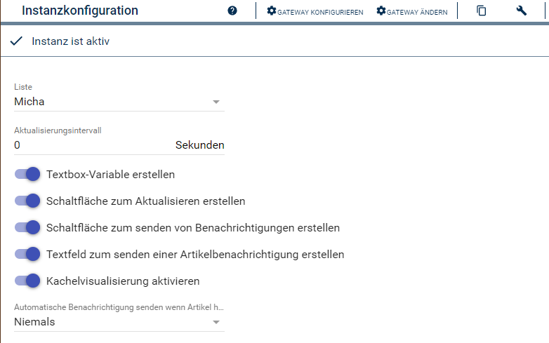

[](https://www.symcon.de/service/dokumentation/entwicklerbereich/sdk-tools/sdk-php/)
[]()
[](https://www.symcon.de/de/service/dokumentation/installation/migrationen/v80-v81-q3-2025/)  
[](https://creativecommons.org/licenses/by-nc-sa/4.0/)
[](https://github.com/Nall-chan/bring-symcon/actions)
[](https://github.com/Nall-chan/bring-symcon/actions)  
[](#2-spenden)[](#2-spenden)  

# Bring List  <!-- omit in toc -->
Abbilden einer Einkaufliste in Symcon.  

## Inhaltsverzeichnis<!-- omit in toc -->

- [1. Funktionsumfang](#1-funktionsumfang)
- [2. Voraussetzungen](#2-voraussetzungen)
- [3. Software-Installation](#3-software-installation)
- [4. Einrichten der Instanzen in IP-Symcon](#4-einrichten-der-instanzen-in-ip-symcon)
- [5. Statusvariablen](#5-statusvariablen)
- [6. Visualisierung](#6-visualisierung)
  - [Kachel Visualisierung](#kachel-visualisierung)
  - [WebFront](#webfront)
- [7. PHP-Befehlsreferenz](#7-php-befehlsreferenz)
- [8. Aktionen](#8-aktionen)
- [9. Anhang](#9-anhang)
  - [1. Changelog](#1-changelog)
  - [2. Spenden](#2-spenden)
- [10. Lizenz](#10-lizenz)

## 1. Funktionsumfang

* Abbilden einer Bring!-Liste in Symcon
* Funktionen zum anpassen der Liste  
* Senden von Bring! Benachrichtigungen

## 2. Voraussetzungen

* IP-Symcon ab Version 8.1

## 3. Software-Installation

* Dieses Modul ist Bestandteil der [Bring!-Library](../README.md#2-software-installation). 

## 4. Einrichten der Instanzen in IP-Symcon

__Konfigurationsseite:__  

  

| Name                              | Text                                                        | Typ    | Beschreibung                                                                                                 |
| --------------------------------- | ----------------------------------------------------------- | ------ | ------------------------------------------------------------------------------------------------------------ |
| listUuid                          | Liste                                                       | string | Auswahl der gewünschten Liste                                                                                |
| RefreshInterval                   | Aktualisierungsintervall                                    | int    | Intervall für den Download der Liste                                                                         |
| EnableTextboxVariable             | Textbox-Variable erstellen                                  | bool   | Textbox für das WebFront                                                                                     |
| EnableRefreshIntegerVariable      | Schaltfläche zum Aktualisieren erstellen                    | bool   | Für manuellen Download der Liste                                                                             |
| EnableNotificationIntegerVariable | Schaltfläche zum senden von Benachrichtigung erstellen      | bool   | Versendet eine Bring! Benachrichtigung                                                                       |
| EnableNotificationStringVariable  | Textfeld zum senden einer Artikelbenachrichtigung erstellen | bool   | Textfeld dessen Inhalt als Benachrichtigung gesendet wird                                                    |
| EnableTileDisplay                 | Kachel Visualisierung aktivieren                            | bool   | Sofern aktiv, wird eine spezielle Kachel für die Kachel-Visualisierung genutzt                               |
| AutomaticallySendNotification     | Automatische Benachrichtigung senden                        | int    | Zeit in Sekunden nach welcher eine Änderung der Liste aus Symcon eine Bring! Benachrichtigung sendet (0=aus) |

## 5. Statusvariablen

Die Statusvariablen/Kategorien werden automatisch angelegt. Das Löschen einzelner kann zu Fehlfunktionen führen.

### Statusvariablen <!-- omit in toc -->

| Ident      | Name                                    | Typ    | Beschreibung                                              |
| ---------- | --------------------------------------- | ------ | --------------------------------------------------------- |
| TextBox    | Kaufen                                  | string | TextBox mit allen Artikeln der Liste.                     |
| Reload     | Liste neu lade                          | int    | Aktions-Variable für neu laden der Liste.                 |
| Notify     | Sende Benachrichtigung                  | string    | Senden von einer Bring! Benachrichtigung                  |
| UrgentItem | Sende dringende Artikelbenachrichtigung | string | Text wird als dringende Artikelbenachrichtigung versendet |

## 6. Visualisierung

### Kachel Visualisierung

  

  

### WebFront

  

## 7. PHP-Befehlsreferenz

```php
boolean BRING_UpdateList(integer $InstanzID);
```
Neu laden der Liste.

Beispiel:
```php
BRING_UpdateList(12345);
```

---

```php
array|false BRING_GetList(integer $InstanzID);
```
Liefert alle Einträge einer Liste

Beispiel:
```php
print_r(BRING_GetList(12345));
```

---

```php
boolean BRING_SendNotify(integer $InstanzID, string $NotificationType);
```
Sendet eine Bring! Benachrichtigung. Zulässige Werte für `NotificationType` sind:  
`CHANGED_LIST`, `GOING_SHOPPING`, `SHOPPING_DONE`

Beispiel:
```php
BRING_SendNotify(12345, 'SHOPPING_DONE');
```

---

```php
boolean BRING_SendUrgentItemNotify(integer $InstanzID, string $ItemName);
```
Sendet eine Bring! Benachrichtigung vom Typ "dringend benötigt", mit dem Artikel aus `ItemName`.  

Beispiel:
```php
BRING_SendUrgentItemNotify(12345, 'Butter');
```

---

```php
boolean BRING_AddItem(integer $InstanzID, string $ItemName, string $Specification);
```
Fügt einen Artikel der Liste hinzu.

Beispiel:
```php
BRING_AddItem(12345, 'Gouda', 'Scheiben');
```

---

```php
boolean BRING_AddToRecentlyItem(integer $InstanzID, string $ItemName, string $Specification);
```
Entfernt einen Artikel von der Liste.

Beispiel:
```php
BRING_AddToRecentlyItem(12345, 'Gouda', 'Scheiben');
```

---

## 8. Aktionen

Keine Aktionen verfügbar.

## 9. Anhang

### 1. Changelog

[Changelog der Library](../README.md#2-changelog)

### 2. Spenden

Die Library ist für die nicht kommerzielle Nutzung kostenlos, Schenkungen als Unterstützung für den Autor werden hier akzeptiert:  

[](https://paypal.me/Nall4chan)  

[](https://www.amazon.de/hz/wishlist/ls/YU4AI9AQT9F?ref_=wl_share) 

## 10. Lizenz

  IPS-Modul:  
  [CC BY-NC-SA 4.0](https://creativecommons.org/licenses/by-nc-sa/4.0/)  
