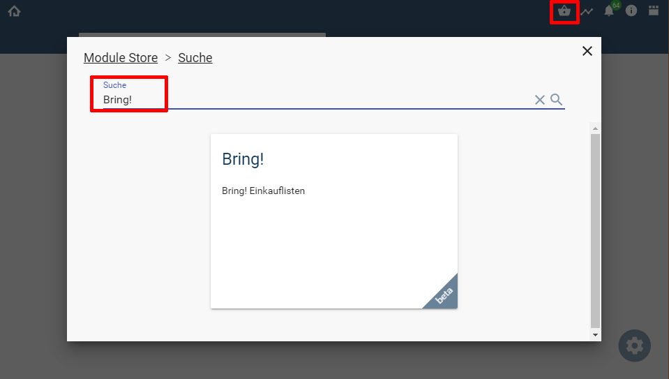
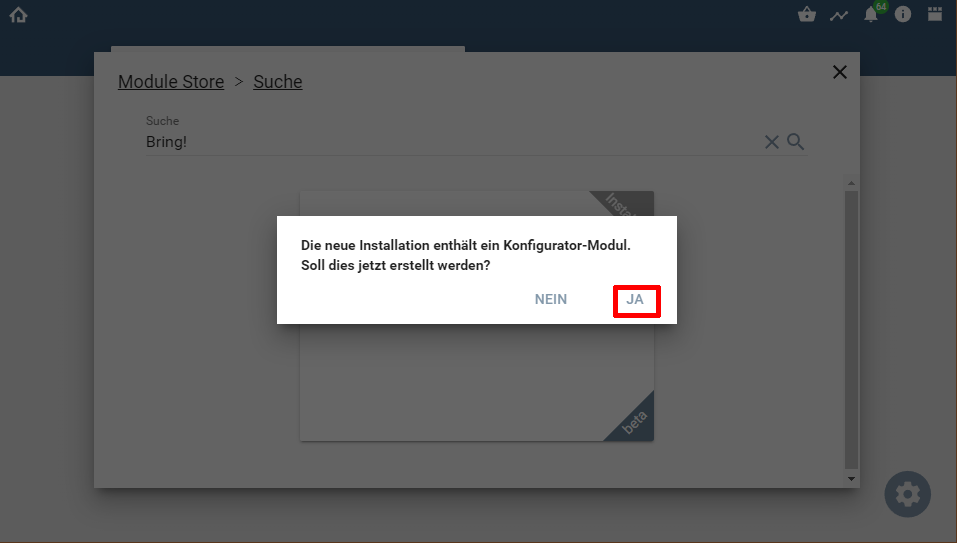
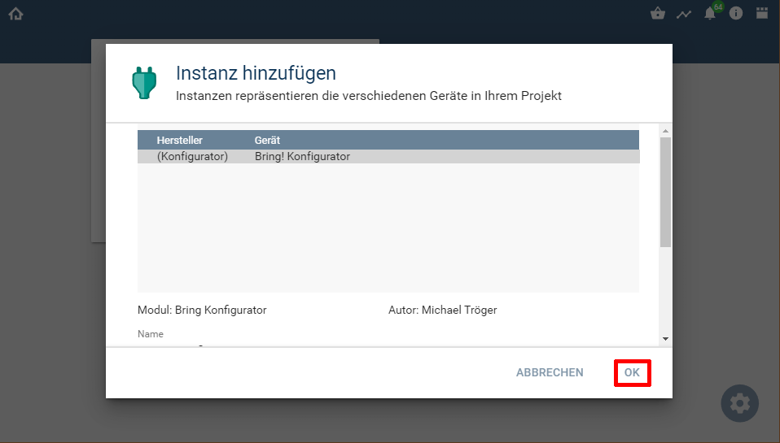
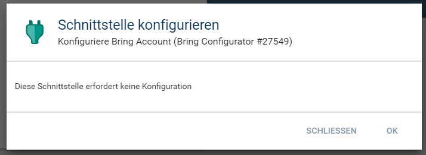

  

  
  

# Bring-Symcon  <!-- omit in toc -->

Einbinden von `Bring!` Einkauflisten in IPS.  

## Inhaltsverzeichnis <!-- omit in toc -->

- [1. Voraussetzungen](#1-voraussetzungen)
- [2. Software-Installation](#2-software-installation)
- [3. Enthaltende Module](#3-enthaltende-module)
- [4. Anhang](#4-anhang)
	- [1. GUID der Module](#1-guid-der-module)
	- [2. Changelog](#2-changelog)
	- [3. Spenden](#3-spenden)
- [5. Lizenz](#5-lizenz)

----------

## 1. Voraussetzungen

* IP-Symcon ab Version 8.1
* Account bei Bring!
 
## 2. Software-Installation
  
 Über den 'Module-Store' in IPS das Modul `Bring!` hinzufügen.  
  **Bei kommerzieller Nutzung (z.B. als Errichter oder Integrator) wenden Sie sich bitte an den Autor.**  

 

Nach der Installation über den Store, wird abgefragt ob ein ([Konfigurator](Bring%20Configurator/README.md)) von diesem Modul automatisch angelegt werden soll.  

  
  

Dadurch wird automatisch die benötigte [Bring! Account-Instanz (IO)](Bring%20Account/README.md) erstellt.  

  

Die weitere Konfiguration ist in der [Konfigurator-Instanz](Bring%20Configurator/README.md#4-einrichten-der-instanzen-in-ip-symcon) beschrieben.  

Allgemeine Informationen zum Hinzufügen von Instanzen in der [Dokumentation der Instanzen](https://www.symcon.de/service/dokumentation/konzepte/instanzen/#Instanz_hinzufügen)

## 3. Enthaltende Module

- __Bring Konto__ ([Dokumentation](Bring%20Account/README.md))  
	IO-Modul für einen Bring! Konto.  

- __Bring Konfigurator__ ([Dokumentation](Bring%20Configurator/README.md))  
	Konfigurator um alle Listen eines Accounts in Symcon anzulegen.  

- __Bring List__ ([Dokumentation](Bring%20List/README.md))  
	Eine Einkaufliste des Accounts als Instanz in Symcon.  

	

## 4. Anhang

###  1. GUID der Module
 
| Modul               | Typ          | Prefix |                  GUID                  |
| :------------------ | :----------- | :----: | :------------------------------------: |
| Bring! Account      | IO           | BRING  | {C6D2590B-D9DB-113F-5EF1-9323E7B9DBDA} |
| Bring! Konfigurator | Configurator | BRING  | {8D4CE681-3632-57A4-AE9D-7265B716B913} |
| Bring! List         | Gerät        | BRING  | {44D63530-0E14-8B8F-3E1A-A79728240524} |

----------
### 2. Changelog

**Version 1.20:**  
- Version für Symcon 8.1 und neuer  
- Durchgängige Nutzung von Darstellungen anstatt von Profilen  

**Version 1.10:**  
- Details konnten im WebFront nicht bearbeitet werden  
 
**Version 1.00:**  
- Beta Release für Symcon 7.1  

----------
### 3. Spenden  
  
  Die Library ist für die nicht kommerzielle Nutzung kostenlos, Schenkungen als Unterstützung für den Autor werden hier akzeptiert:  

 

## 5. Lizenz

  IPS-Modul:  
  [CC BY-NC-SA 4.0](https://creativecommons.org/licenses/by-nc-sa/4.0/)  
 

